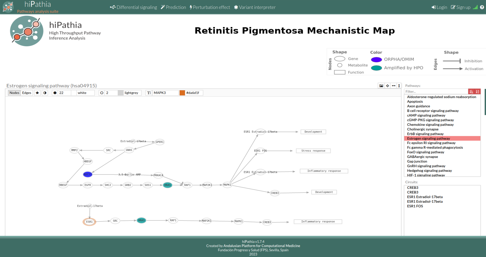

# DRExM³L modelization of Retinitis Pigmentosa
> In this work we propose a unique approach that, starting from the set of RP disease affected genes, provides a comprehensive landscape of the molecular mechanisms of the disease along with its druggable space. The method establishes a mechanistic disease map as an actionable environment, and employs an explainable machine learning model, “Drug REpurposing using Mechanistic Models of signal transduction and eXplainable Machine Learning” (DRExM³L), to assess the influence of druggable molecules, like drug target proteins, over the disease environment. Our approach merges information from transcriptomics, pathway graphs, biological/clinical, and drug-target interactions databases, to generate an in-depth view of the disease. The novelty of this workflow lies in the integration of multiple data sources, reinforcing interpretability with biological knowledge while reducing the dimensionality of the datasets.

## Table of Contents
* [Input Data](#Input-data)
* [RP Mechanistic Map](#RPMap)
* [Setup and Usage](#Setup-and-Usage)
* [Contact](#contact)

## Input Data

The necessary data to reproduce the results of the manuscript can be downloaded from [Zenodo](https://zenodo.org/record/7969017). Note that the workflow will try to automatically download the data after installing the dependencies.

- The Genotype-Tissue Expression (GTEx) RNA-Seq Data Gene read counts:
  - File name: GTEx_Analysis_2017-06-05_v8_RNASeQCv1.1.9_gene_reads.gct
  - File path: data/raw
  - Source download: https://gtexportal.org/home/datasets

- The DrugBank 5.1.8 db :
  - File name: drugbank-v050108.xml.gz
  - File path: data/raw
  - Source download: https://go.drugbank.com/releases

- Disambiguations for ambiguous drug action annotations - DrugBank 5.1.8 db :
  - File name: amendments_drugActions_drugbank-v050108.tsv
  - File path: data/raw
  
- Public databases downloaded through VarfromPDB R package:
  - File name: localPDB.tar.gz - static databases April 2020 
  - Source: https://cran.r-project.org/web/packages/VarfromPDB/VarfromPDB.pdf

- The Anatomical Therapeutic Chemical (ATC) Classification table:
  - File name: ATC.csv
  - File path: data/raw
  - Source download: https://bioportal.bioontology.org/ontologies/ATC - 2022AB CSV file

- The Human Phenotype Ontologies database (HPO):
  - File name: hp.obo-v1.2-20190906
  - File path: data/raw
  - Source download: https://hpo.jax.org/app/data/ontology - September 6th, 2019 release

- The Human Phenotype Ontologies (HPO) annotations linking diseases and phenotypes
  - File name: phenotype_annotation20190906.tab
  - File path: data/raw
  - Source download: https://hpo.jax.org/app/data/annotations - September 6th, 2019 release

- The Human Phenotype Ontologies (HPO) annotations linking genes and phenotypes
  - File name: phenotype_to_genes20191010.txt
  - File path: data/raw
  - Source download: https://hpo.jax.org/app/data/annotations - September 6th, 2019 release

- HiPathia's list of physiological KEGG signaling pathways
  - File name: physiological_paths.tsv
  - File path: data/raw
  - Source: http://hipathia.babelomics.org/
  
- HiPathia's list of physiological KEGG signaling pathways with GO/Uniprot functional annotations 
  - File name: physPathsAnnot.tsv
  - File path: data/raw
  - Source: http://hipathia.babelomics.org/

## RP Mechanistic Map

> RP Mechanistic Map [_here_](http://hipathia.babelomics.org/RP_Mechanistic_Map/).

## Setup and Usage
The project requires a working `conda` and a `GNU/Linux x64` system. If `conda` is not available,
 the workflow will try to install the `miniconda` distribution.

Copy `example.env` to `.env`.

- Set `UPDATE=false`, the default option, to reproduce the manuscript results.

If using a SLURM-based HPC, run the full analysis with:
`sbatch run.sbatch`

If using `bash`, the same script could be used in a non-SLURM system.

### Updating

We have included a minimal update mechanism to facilitate the reanalysis of the disease:
 
- Set `UPDATE=true` and we will try to update the databases, use the last version of the Hipathia model, etc.
  - To update the Drugbank release, copy the `xml` file to `data/raw` and change `DRUGBANK_VERSION` in `.env`.
  - To update the GTEx counts, copy the `gct` file to `data/raw` and update `GTEX_FNAME` in `.env`.
  - Follow the same procedure with the `hpo.obo` files.
  - RP experts could update the manually curated files.
  - DRExM³L will be automatically updated to the last stable release.
- Set `USE_GPU=N` to use the indicated number of GPUs, `N=1, 2, ...` (0 for CPU).

## Authors and contributors

The code of this project is released under the MIT license.

Authors and contributors:

- Marina Esteban-Medina <marina.esteban@juntadeandalucia.es>
- Kinza Rian <kinza.rian@juntadeandalucia.es>
- Joaquin Dopazo <joaquin.dopazo@juntadeandalucia.es>
- Maria Peña-Chilet <mariapch84@gmail.com>
- Carlos Loucera <carlos.loucera@juntadeandalucia.es>
